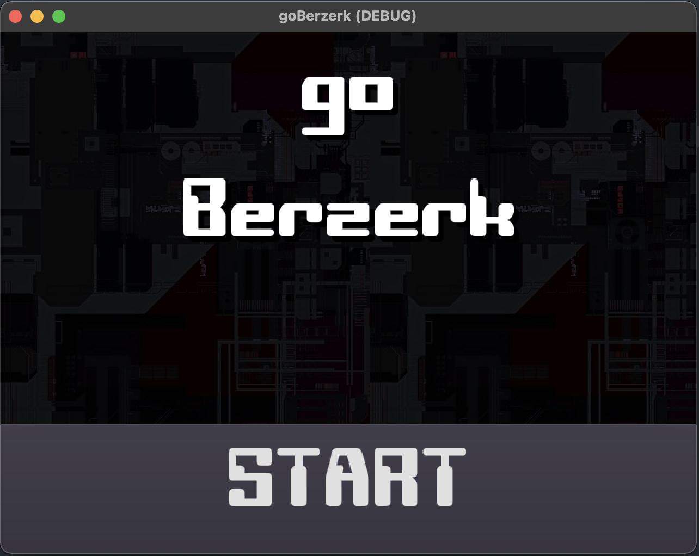
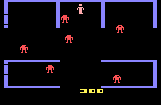
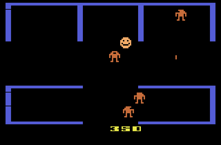

# goBerzerk

A recreation of the game Berzerk, but built in the Godot Engine

## My Inspiration

### Credits:

I usually give credit where credit is due here in the Readme.

 - font [COMPUTER Robot Font by weknow](https://www.fontspace.com/computer-robot-font-f19870)

 - font - Andrew Young - LAZENBY COMPUTER https://www.dafont.com/lazenby-computer.font

 - Special thanks to spriters-resource.com, finding this sprite sheet helped in the design of my sprites and animations.
https://www.spriters-resource.com/arcade/berzerk/sheet/109274/

---

## TODO:

#### Main:

    - Procedural generation of levels
    - Add EvilOtto timer   **DONE**
    - Figure out game mechanics  **Will not finish**
        - Add bonus for destroying all robots
        - Change levels re-runs level generation
    - Rework HUD to more like original Berzerk game   **DONE**
        - Reworked HUD   **DONE**
        - Find a old school font   **DONE**

#### Player:

    - Change out to better player character   **DONE**
    - Figure out how to shoot lazers in cardinal directions   **DONE**
    - Create a fricken lazer   **DONE**
    - Get a lazer sound   **DONE**

#### Robot:

    - Spawn nicely to NOT kill player on game start
    - Spawn more robots on level up   **DONE**
    - Fix hurt() to play sound and aninmation
    - Create a sprite and animations   **DONE**
    - Create a fricken lazer    **DONE**
        - Shoot towards player   **DONE**
    - Get a lazer sound   **DONE**
    - Script to follow and shoot player with lazers   **DONE**
        - Maybe a ray cast to detect player then shoot?   **DONE**
    - Script to randomly play taunts   **DONE**

#### SpikeBall -> FrickenLazers

    - Turn into a fricken lazer [sprite/shader]   **DONE**
    - Get a lazer sound   **DONE**

#### EvilOtto:

    - Start to create it   **DONE**
    - Figure out how to bounce?   **DONE**
        - Animation player with squash?   **DONE**
    - Script to follow player   **DONE**
        - Maybe a ray cast to detect player then set velocity and direction?   **DONE**
    - Script to randomly play taunts   **DONE**
